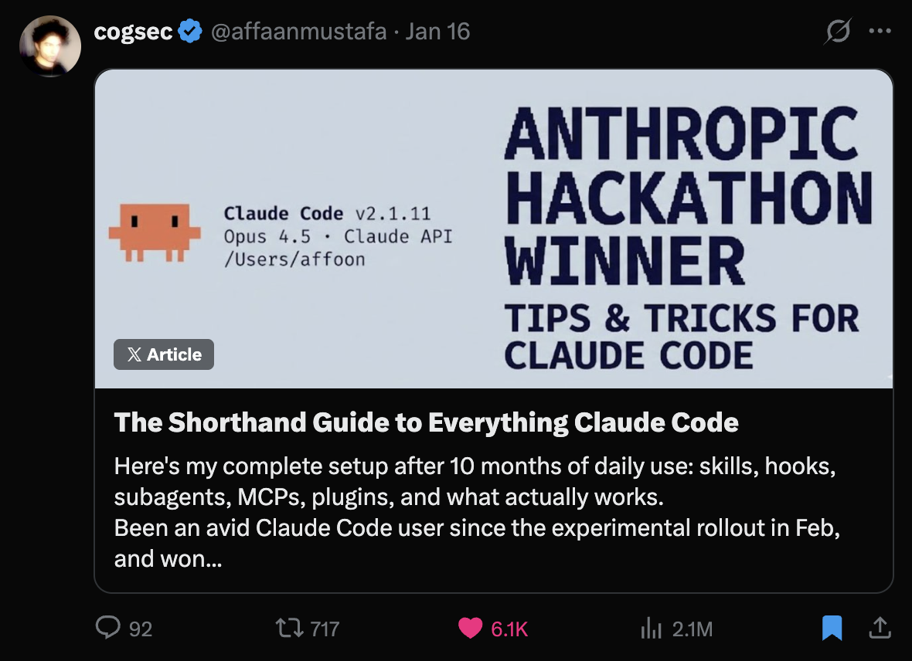
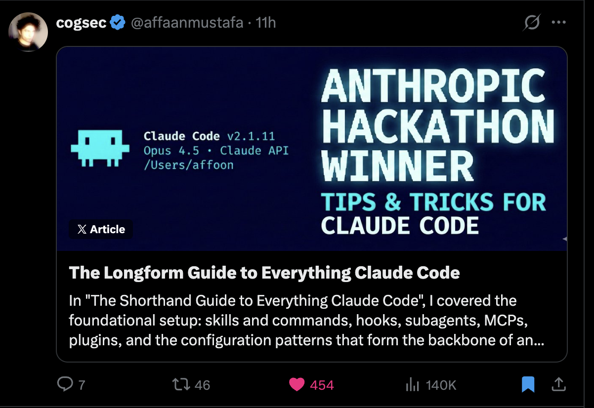

# Affaan Mustafa

Builder. Writer. 70k peak viewers streaming dev on X.

**[affaanmustafa.com →](https://affaanmustafa.com)**

---

## Now

**Founding Engineer @ [PMX Trade](https://pmx.trade)** — Next-gen trading infrastructure

**Creator of [everything-claude-code](https://github.com/affaan-m/everything-claude-code)** — 12,800+ stars. Complete Claude Code configs.

**Writing on [X](https://x.com/affaanmustafa)** — Articles on AI agents, cogsec, and building in public

---

## Writing

Author of both Claude Code guides — 2.1M+ views combined

<table>
<tr>
<td width="50%">

</td>
<td width="50%">

</td>
</tr>
<tr>
<td align="center"><b>Shorthand Guide</b> 6.1K ❤️ · 2.1M views</td>
<td align="center"><b>Longform Guide</b> 454 ❤️ · 140K views</td>
</tr>
</table>

---

## Highlights

| | |
|---|---|
| **elizaOS Core Developer** | Most used AI agent framework in Web3 — 17k+ stars, 5.3k+ forks |
| **First Autonomous Solana Trading Agent** | [@stoictradingai](https://github.com/affaan-m/stoictradingAI) — $2M+ trades, $38M peak FDV |
| **70k Concurrent Viewers** | Live-streamed building 15+ hrs/day for 2 months |
| **Anthropic Hackathon Winner** | [Zenith Chat](https://zenith.chat) — 1st/100+ teams, $15k credits |
| **Published Researcher** | [HyperMamba](https://papers.ssrn.com/sol3/papers.cfm?abstract_id=5137471) — meta-learning for trading |
| **$150k+ Ecommerce Exit** | Founded DCUBE at 18, self-funded tuition |

---

## Open Source

| Repository | What |
|------------|------|
| [everything-claude-code](https://github.com/affaan-m/everything-claude-code) | Complete Claude Code configs — agents, skills, hooks, MCPs |
| [dprc-autotrader-v2](https://github.com/affaan-m/dprc-autotrader-v2) | Autonomous trading agent in Rust |
| [Sol-Onchain-Analyst](https://github.com/affaan-m/Sol-Onchain-Analyst) | Solana data pipelines → trading alphas |
| [HyperMamba](https://github.com/affaan-m/HyperMamba) | Hypernetwork-enhanced meta-learning for trading |
| [Behavioral_RL](https://github.com/affaan-m/Behavioral_RL) | RL with behavioral economics biases |

---

[X](https://x.com/affaanmustafa) · [LinkedIn](https://linkedin.com/in/affaanmustafa) · [Telegram](https://t.me/affaanmustafa) · [ResearchGate](https://www.researchgate.net/profile/Affaan-Mustafa) · [YouTube](https://www.youtube.com/@AffaanMustafa)

---

*"The zero employee company idea never left my mind."*
